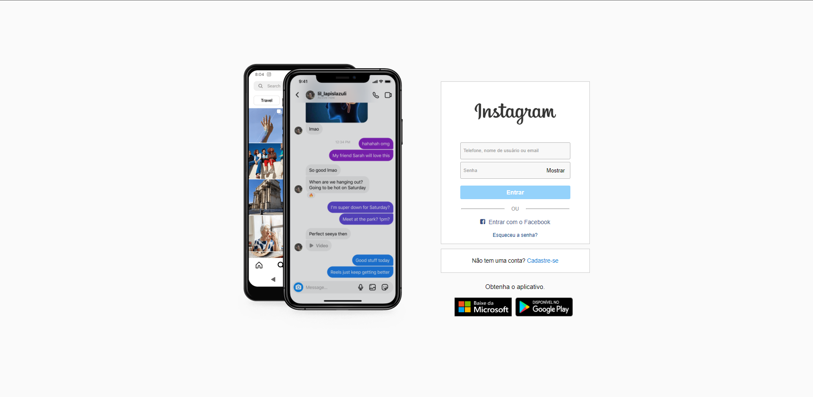
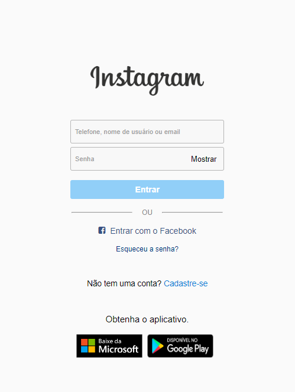
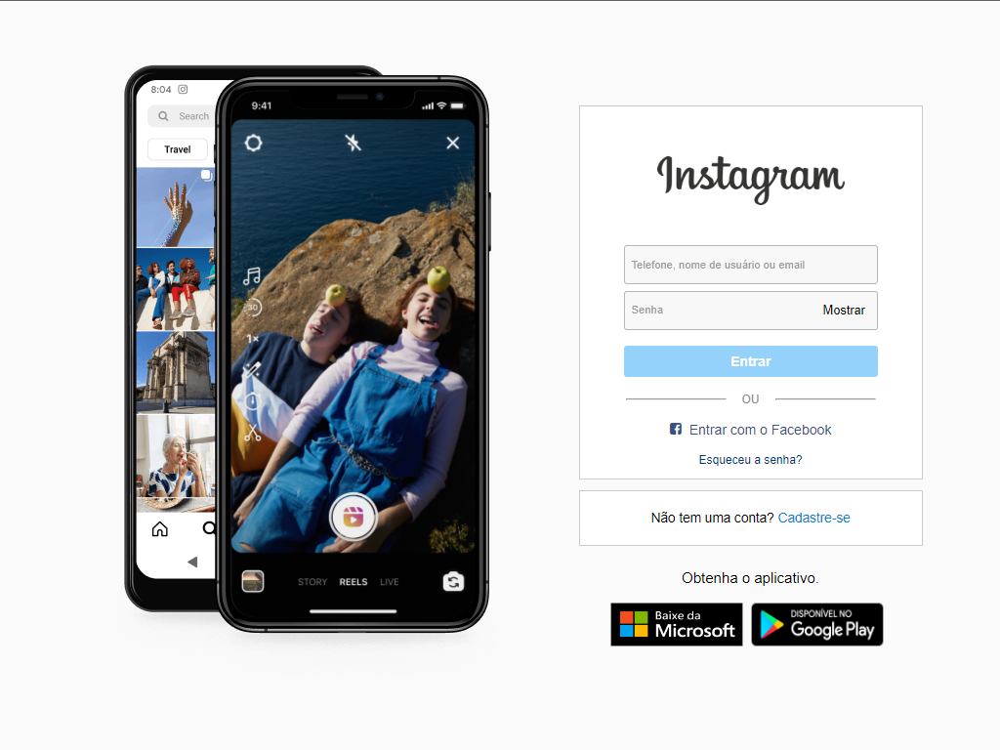

# Clone Login Instagram

Nesse projeto, clonei a página de login da rede social Instagram ao meu estilo e consegui obter os resultados que eu queria.

No computador a página do Instagram ficou deste modo:

E no celular:

Já no tablet ficou desta forma:

## O que aprendi?

Com esse projeto aprendi a adaptar o projeto para outros dispositivos com resoluções diferentes, além de aprender a usar expressões regulares (regex), me auxiliando na validação do email, telefone e senha.

## Tecnologias Usadas:

<code></code>
<code></code>
<code></code>

## Como posso visitar?

Basta clicar no link: <code><a href="">Clone Instagram</a></code>

## O que desejo acrescentar?

- [x] Sistema de validação de e-mail
- [x] Sistema de validação de senha
- [x] Sistema para mostrar senha
- [x] Arrumar o input, como a página real
- [x] Fazer um slider nas fotos dos celulares, como a página real
- [x] Fazer um sistema de login
